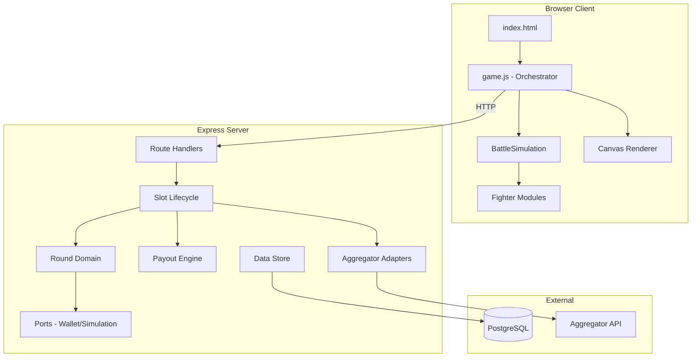
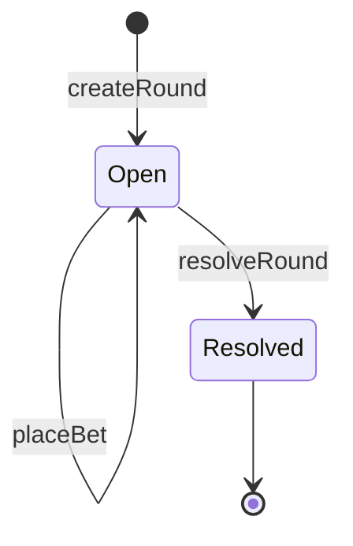

# Architecture

## System Overview

## Architectural Patterns

### Hexagonal Architecture (Server)

The server uses ports-and-adapters (hexagonal) architecture:

- **Ports**: Define interfaces for external dependencies (`server/ports/`)
  - `wallet.js` — wallet debit/credit interface
  - `simulation.js` — simulation execution port (bridges server to client simulation engine)
- **Adapters**: Implement port interfaces for specific providers (`server/adapters/`)
  - `aggregator-interface.js` — abstract base class for aggregator adapters
  - `aggregator-stub.js` — in-memory stub for development/testing
- **Lifecycle**: Orchestrates business workflows (`server/lifecycle/`)
  - `slot.js` — complete slot-round lifecycle with compensation on failure

### Deterministic Simulation

The simulation engine is fully deterministic:
- Seeded PRNG (mulberry32) ensures identical outcomes for the same seed
- Server generates seed, hashes it (SHA-256) for provable fairness
- Client replays the same simulation for visual playback
- Shared code: `src/core/simulation.js` is imported by both client and server (via `server/ports/simulation.js`)

### Domain-Driven Round Model

Round lifecycle follows a state machine:

### Client Architecture

The client is a single-page application with no framework:
- `game.js` orchestrates UI state, server communication, and playback
- Simulation runs headlessly (no rendering), captures frames
- Renderer replays captured frames with visual effects
- No client-side routing — single view with state transitions

## Key Design Decisions

1. **Shared simulation code** — Server imports client simulation module to ensure provable fairness
2. **Compensation pattern** — Slot lifecycle debits first, then compensates (refunds) on failure
3. **Idempotent transactions** — Wallet operations use `txRef` for dedup
4. **Monte Carlo-calibrated odds** — Win probabilities derived from simulation runs, not arbitrary
5. **Tiered payouts** — Winner's remaining HP determines payout multiplier (obliterate/close/clutch)
