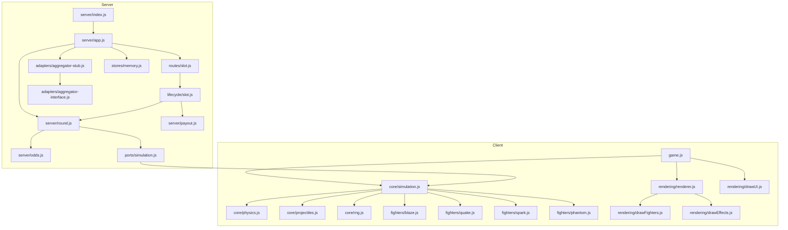

# Dependencies

## Production Dependencies

| Package | Version | Purpose |
|---------|---------|---------|
| express | ^5.2.1 | HTTP server framework (v5 — async error handling) |
| cors | ^2.8.6 | Cross-origin resource sharing middleware |
| pg | ^8.20.0 | PostgreSQL client (connection pooling, query execution) |

## Development Dependencies

| Package | Version | Purpose |
|---------|---------|---------|
| vitest | ^2.1.9 | Test runner (Vite-based, ESM-native) |
| supertest | ^7.2.2 | HTTP assertion library for API testing |

## Notable Transitive Dependencies

| Package | Brought By | Purpose |
|---------|-----------|---------|
| @noble/hashes | pg | Cryptographic hashing (SCRAM auth) |
| @paralleldrive/cuid2 | pg | Unique ID generation |
| vite | vitest | Dev server / module resolution for tests |

## Client Dependencies

The client has **zero npm dependencies**. It uses:
- Browser-native Canvas 2D API
- Browser-native Fetch API
- Browser-native localStorage
- ES Modules loaded directly via `<script type="module">`

## Internal Dependency Graph

## Key Observation

The simulation engine (`src/core/simulation.js`) is shared between client and server. The server imports it via `server/ports/simulation.js`, creating a cross-boundary dependency that ensures provable fairness (same code produces same results).
