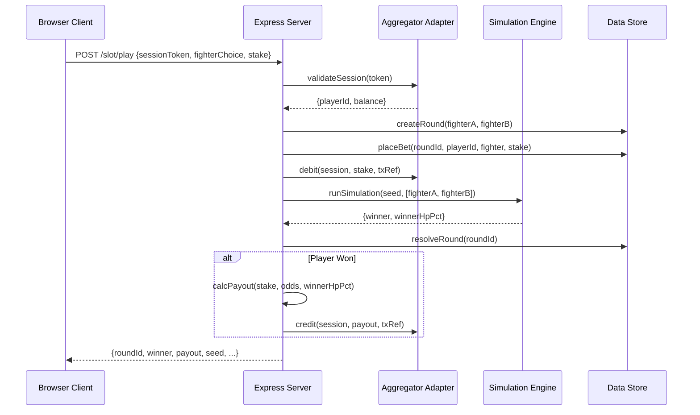
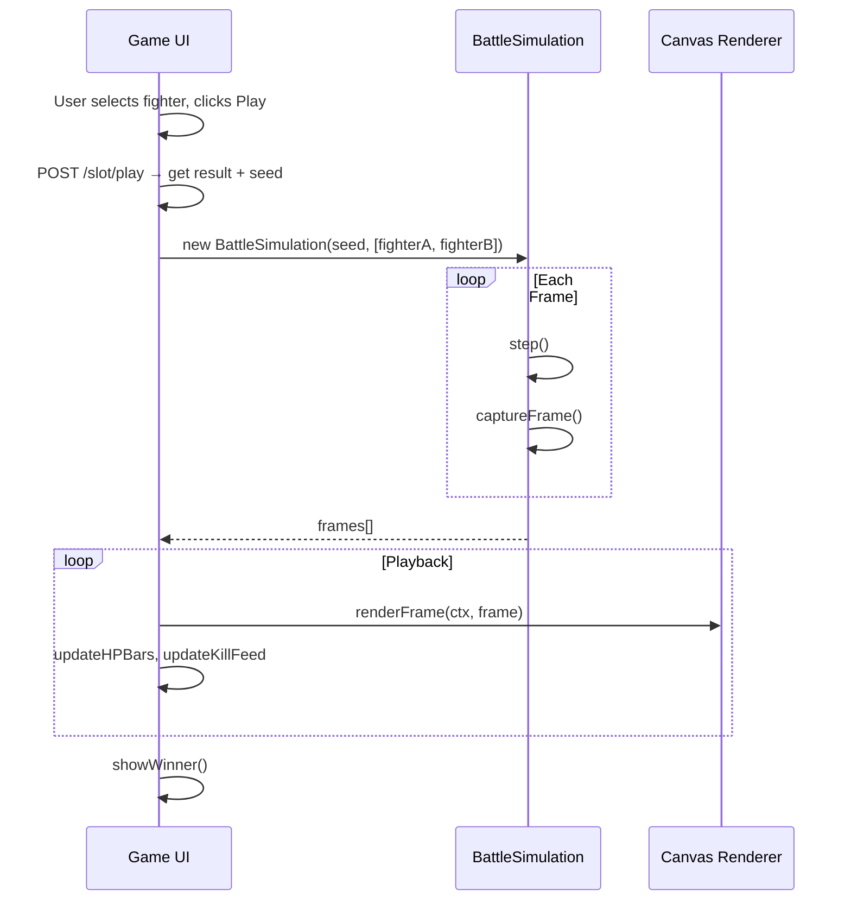
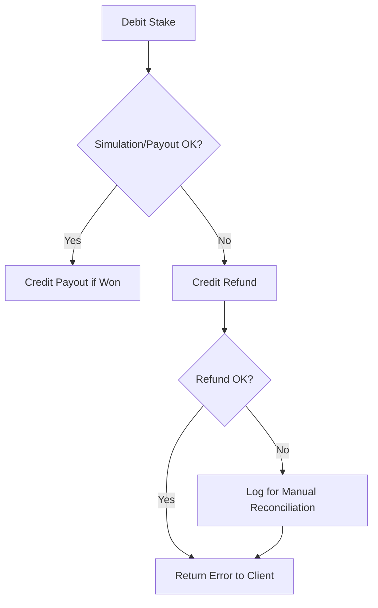
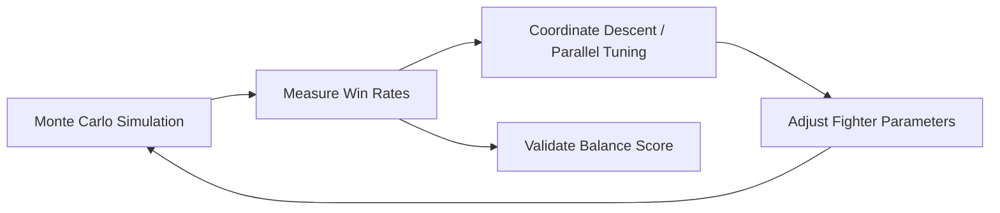

# Workflows

## Slot Round Lifecycle (Primary Flow)

## Client Playback Flow

## Compensation Flow (Error Handling)

## Balance Tuning Workflow (Scripts)

Scripts in `scripts/`:
- `montecarlo.js` — runs N simulations per matchup, reports win rates
- `tune-balance.js` — coordinate descent optimizer for fighter parameters
- `tune-parallel.js` — parallel evolutionary parameter search
- `ball-montecarlo.js` — quick matchup win-rate measurement
